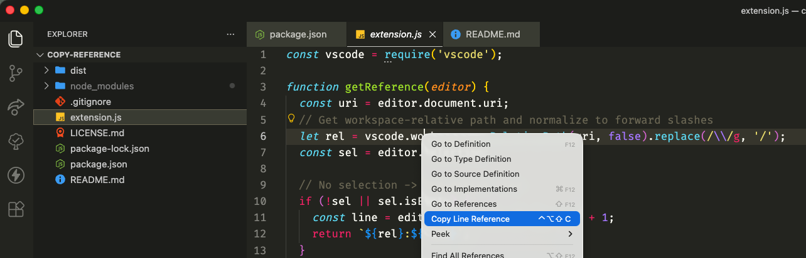

# Copy Line Reference (minimal extension)

## Usage
Right‑click in the editor → **Copy Line Reference** to copy:
- `relative/path/to/file.js:12` for a cursor or single-line selection
- `relative/path/to/file.js:12-20` for a multi-line selection

## Notes
- Uses workspace-relative paths (`asRelativePath`). If the file is outside your workspace, it falls back to an absolute path.
- Path separators are normalized to `/`.

# Development

## Quick try (no packaging)
1. Open this folder in VS Code.
2. Press `F5` (Run Extension) to launch an Extension Development Host.
3. Open any file, right‑click → **Copy Line Reference**.

## Package a VSIX
Run `npm run build` to create `dist/copy-line-reference-vscode.vsix`.
